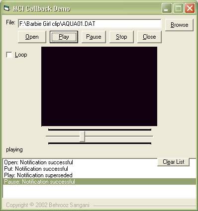



## MCI Callback Demo

### Description

First thing you get from this demo is how to auto repeat media files WITHOUT a timer. It also includes basic MCI functions to play almost all media formats from mp3 to qt (QuickTime). I searched everywhere I knew and couldn't find any example of MCI callback even in advanced MP3 players. so I decided that it worths working on.
 
### More Info
 

             |
---                |---
**Submitted On**   |2002-09-26 11:46:02
**By**             |[Behrooz Sangani](https://github.com/Planet-Source-Code/PSCIndex/blob/master/ByAuthor/behrooz-sangani.md)
**Level**          |Intermediate
**User Rating**    |4.8 (19 globes from 4 users)
**Compatibility**  |VB 6\.0
**Category**       |[Sound/MP3](https://github.com/Planet-Source-Code/PSCIndex/blob/master/ByCategory/sound-mp3__1-45.md)
**World**          |[Visual Basic](https://github.com/Planet-Source-Code/PSCIndex/blob/master/ByWorld/visual-basic.md)
**Archive File**   |[MCI\_Callba1366139262002\.zip](https://github.com/Planet-Source-Code/behrooz-sangani-mci-callback-demo__1-39286/archive/master.zip)

